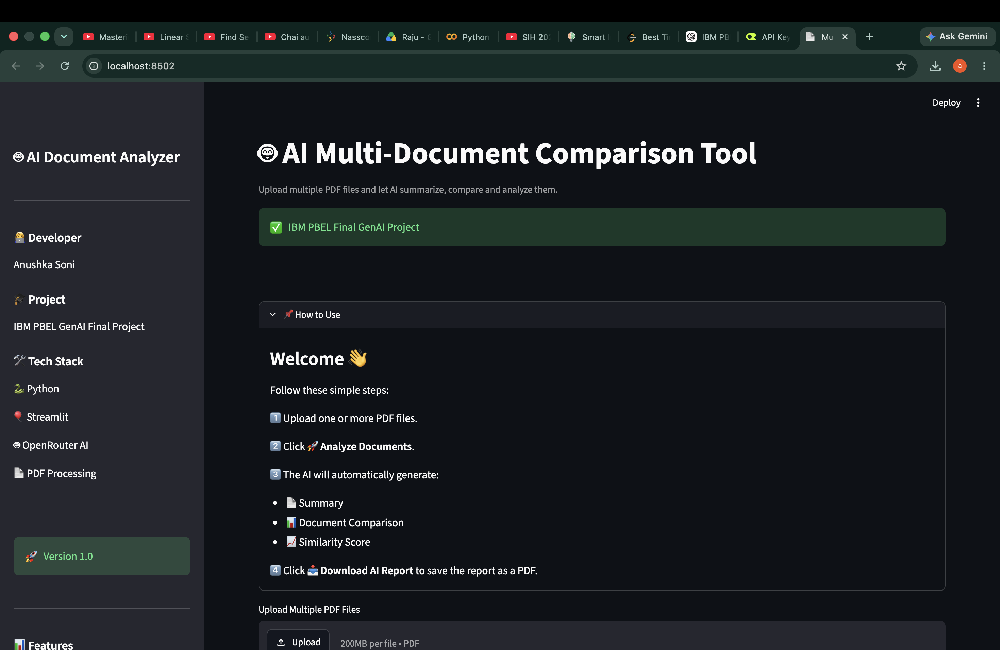
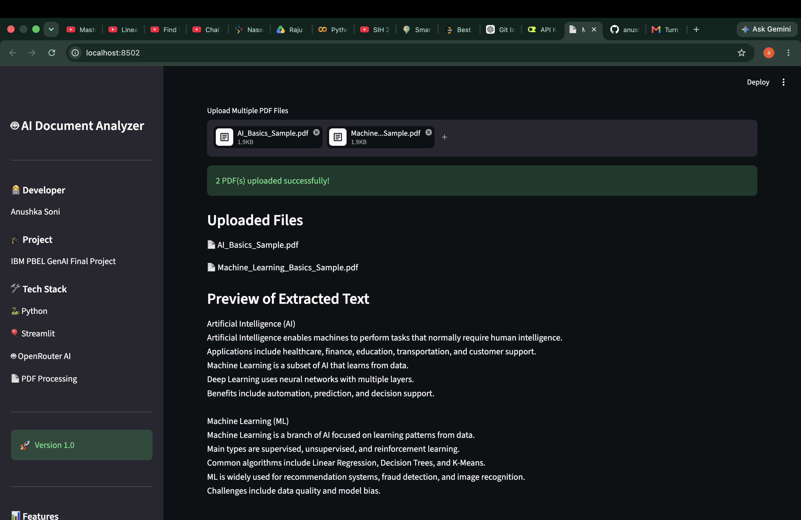
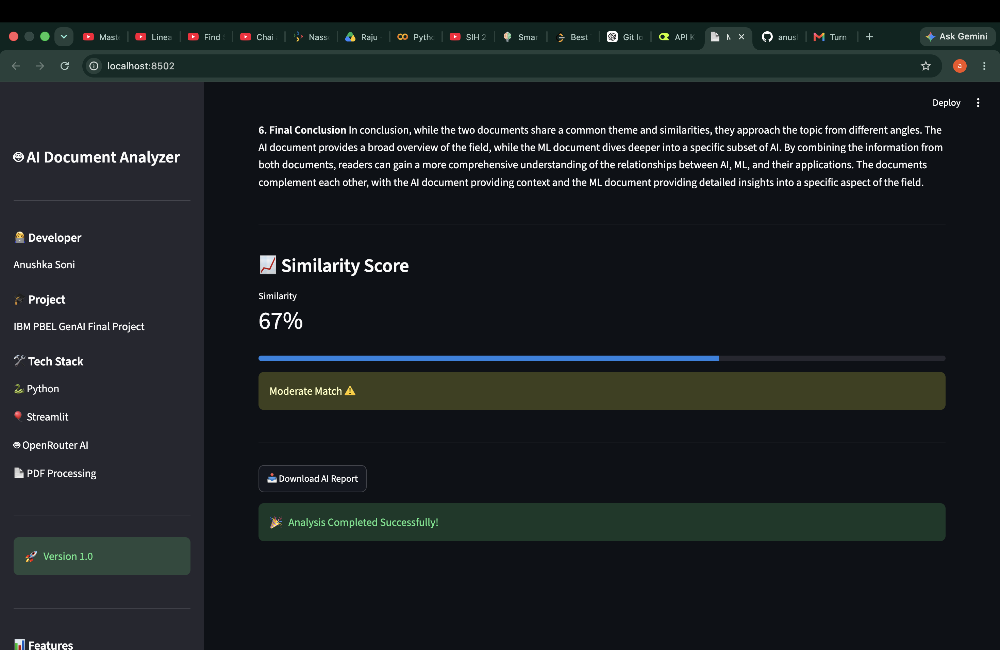

# 📄 Multi-Document Comparison Tool

A Python-based AI-powered application that compares multiple PDF documents, identifies similarities and differences, and generates a concise comparison report using Google's Gemini API.

---

## 🚀 Features

- 📑 Read and process multiple PDF documents
- 🤖 AI-powered document comparison using Gemini
- 📊 Generate summarized comparison reports
- 📝 Extract key similarities and differences
- ⚡ Fast and simple interface

---

## 🛠️ Tech Stack

- Python
- OpenRouter API (Google Gemini Model)
- PyPDF2 / PDF Processing
- Streamlit (if used)
- Git & GitHub

---

## 📂 Project Structure

```
Multi-Document-Comparison-Tool/
│
├── app.py
├── compare.py
├── embeddings.py
├── gemini.py
├── pdf_reader.py
├── prompts.py
├── report.py
├── requirements.txt
├── README.md
└── .gitignore
```

---

## ⚙️ Installation

Clone the repository

```bash
git clone https://github.com/anushkasoni0709-netizen/Multi-Document-Comparison-Tool.git
```

Move to project folder

```bash
cd Multi-Document-Comparison-Tool
```

Install dependencies

```bash
pip install -r requirements.txt
```

Create a `.env` file and add your Gemini API key:

```env
GEMINI_API_KEY=your_api_key_here
```

---

## ▶️ Run the Project

```bash
python app.py
```

---

## 📌 Future Improvements

- DOCX support
- Better report visualization
- Side-by-side comparison UI
- Export comparison as PDF
- Semantic search using embeddings

---

## 👩‍💻 Author

**Anushka Soni**

B.Tech CSE (AI) | Galgotias College of Engineering and Technology

GitHub:
https://github.com/anushkasoni0709-netizen

---

## ⭐ If you found this project useful, don't forget to star the repository.

---

## 📸 Project Screenshots

### 🏠 Home Page


### 📂 Upload PDF Files


### 📊 AI Analysis Result

